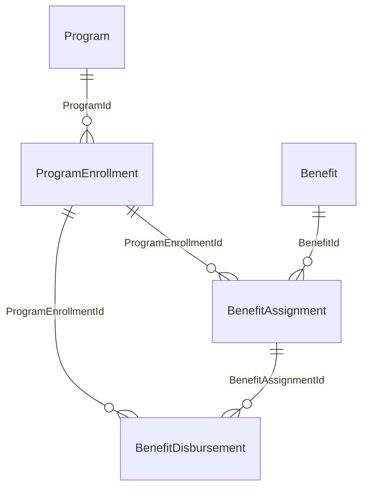

# Using the Financial Assistance Data Model in AFLS

This project uses Salesforce Financial Assistance objects to support Co-Pay enrollment and claims/disbursement workflows.

AFLS is powerful because teams can leverage existing Salesforce platform data models used across LSC and Health Cloud, as long as the required permissions and licenses are provisioned.

## Mobile Enablement Setup

This repo also documents how to make Financial Assistance objects show up correctly in mobile experiences.

- Grant visibility to the objects through the right permission sets and/or PSL-based access.
- For standard objects, add the standard tab into the target app (for example, `Life Sciences Commercial`).
- In profile or permission set tab settings, set the tab to `Default On`; at minimum, ensure it is not `Tab Hidden`.
- Validate in the online app first that end users see the tab by default.
- Assign page layouts for these objects to the target profile; missing page layout assignment can cause online errors and blank mobile views.
- Before creating OMCC (Object Metadata Cache Configuration), confirm the profile has `Read` access to the objects.
- Create OMCC entries and map them to the intended profiles.
- Seed representative data so the mobile UI can be validated end-to-end.

## Screens

## Objects In Scope

- `ProgramEnrollment`: enrollment record for a patient/member in a financial assistance program.
- `BenefitAssignment`: assignment of a specific benefit to a program enrollment.
- `BenefitDisbursement`: fulfillment/disbursement events tied to a benefit assignment.
- `Program`: parent program definition referenced by enrollments.
- `Benefit`: benefit definition referenced by benefit assignments.
- `BenefitType`: required reference object used by `Benefit` records.

## Relationship Model

## Field Notes

- `ProgramEnrollment` requires:
  - `Name`
  - `ProgramId`
  - `IsActive` should be `true` before assignment/disbursement flows.
- `BenefitAssignment` requires:
  - `BenefitId`
  - `ProgramEnrollmentId` is used to tie assignment to enrollment.
- `BenefitDisbursement` requires:
  - `BenefitAssignmentId`
  - `ActualCompletionDate`
  - In this org, `OwnerId` is not present on this object.

## Permission Model

Use permission set `ManageFinancialAssistanceProgram` to grant object access needed for:

- `ProgramEnrollment`
- `BenefitAssignment`
- `BenefitDisbursement`
- `BenefitType` (dependency for `Benefit`)

## Example Seed Data Flow

1. Create `ProgramEnrollment` for a user (for example, an FSR), set `IsActive = true`.
2. Create `BenefitAssignment` linked to that enrollment and a `Benefit`.
3. Create `BenefitDisbursement` linked to the assignment (and enrollment where applicable).

This gives an end-to-end Co-Pay flow: enrollment -> assigned benefit -> disbursement/claim capture.

## Add a Tab to "Life Sciences Commercial"

Use Salesforce Setup UI (recommended for managed app nav updates):

1. Go to `Setup` -> `App Manager`.
2. Find app `Life Sciences Commercial`.
3. Click the dropdown on the row and select `Edit`.
4. Open `Navigation Items`.
5. In `Available Items`, select the object/tab you want (for example `Program`), then click `Add`.
6. Reorder the tab if needed.
7. Click `Save`.

Notes:
- If the app is managed and locked for metadata updates, UI edit is the supported path.
- Users must also have object permission and tab visibility to see and open the tab.
- For this project setup, set the `Program` tab to `Default On` for profile `Field Sales Representative` (tab API name: `standard-Program`).
- For each project object (`Program`, `ProgramEnrollment`, `BenefitAssignment`, `BenefitDisbursement`, `Benefit`, `BenefitType`), make sure a page layout is assigned to profile `Field Sales Representative` (`Setup` -> `Object Manager` -> `<Object>` -> `Page Layouts` -> `Page Layout Assignment`).

## Compliance Disclaimer

If any patient information is stored or processed, you are solely responsible for ensuring HIPAA compliance (including access controls, minimum necessary use, encryption, retention, auditability, and applicable BAAs/policies).
